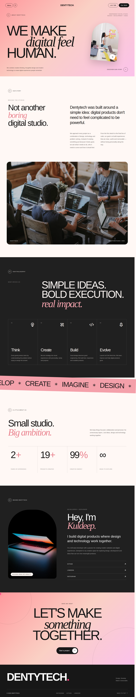

# Web1.0

A simple responsive web project showcasing a home page, about page, and contact page built with HTML, CSS, and JavaScript.

## Project Showcase

Here are a few screenshots from the project:





## Features

- Responsive and clean layout
- Easy navigation between pages
- Modern contact and about sections
- Lightweight project structure

## Connect & Project Links

- Instagram: [kuldeep_patel.dev](https://www.instagram.com/kuldeep_patel.dev/)
- LinkedIn: [kuldeep-patel-09a0041a7](https://www.linkedin.com/in/kuldeep-patel-09a0041a7/)
- GitHub: [Devkuldeep/Web1.0](https://github.com/Devkuldeep/Web1.0)
- Clone: `git@kuldeep:Devkuldeep/Web1.0.git`
- Startup: [TechServeNexus](https://www.techservenexus.com/)
- X: [@KuldeepDev_](https://x.com/KuldeepDev_)
- YouTube: [Kuldeep Dev](https://www.youtube.com/channel/UCBUPxmPzjUqOIcEnbb--0Rw)

## How to Run

Open the project in your browser by launching the main file:

```bash
xdg-open index.html
```

Or simply double-click the index.html file in your file manager.